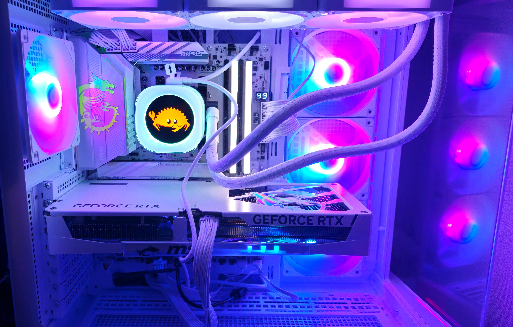
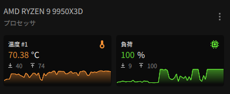

> [!WARNING]
> This article is translated by AI and may contain a serious mistake.

I took the plunge and moved to a new PC.

Since I've been replacing parts here and there on my old PC, it's hard to say exactly how long it's been, but at least the CPU was purchased in October 2021. Ancient times.

I'll record the configuration of my new PC and rustc compilation times for future reference.

## Configuration



- CPU: AMD Ryzen 9 9950X3D
- GPU: NVIDIA RTX 5070 Ti
- M/B: MPG X870E EDGE TI WIFI
- CPU fan: iCUE LINK TITAN 360 RX RGB LCD White
- RAM: Corsair CMH32GX5M2E6000C36W
- SSD: WD_Black SN7100
- case: MSI MAG PANO 100R PZ WHITE
- PSU: Steel Legend SL-1000GW

Since I do CPU-heavy tasks like compiling rustc, I went with a strong CPU, and a decent GPU since I also play games moderately.

This time I did a white build. It's refreshing and nice.

## rustc builds

Bootstrap config is as follows:

```toml
profile = "compiler"
build.jobs = 28
```

Time when running `./x test tests/ui` after `./x clean`:

```shell
❯ hyperfine -r 1 './x t tests/ui'
Benchmark 1: ./x t tests/ui
  Time (abs ≡):        234.682 s               [User: 2560.617 s, System: 735.184 s]
```

Seems pretty fast.

Load looks like this:



When running UI tests after making random changes:

```shell
❯ hyperfine -r 1 './x t tests/ui'
Benchmark 1: ./x t tests/ui
  Time (abs ≡):        135.148 s               [User: 1277.302 s, System: 634.298 s]
```

About 2 minutes.

Check build takes about 1 minute 30 seconds:

```shell
❯ hyperfine -r 1 './x c'
Benchmark 1: ./x c
  Time (abs ≡):        97.852 s               [User: 148.231 s, System: 11.708 s]
```

I can't say much since I forgot to measure the compilation time on my old PC, but it's not bad, I guess...?

I haven't been compiling rustc recently, so it's hard to feel the benefits. Unfortunate. Well, I'm satisfied with the absolute values at least.

## Closing

This is the first time I've built a PC with an emphasis on aesthetics, so I'm quite excited.

I'm also grateful to my old PC, which supported my OSS activities for about 4 years. I'll continue the work at my own pace.
