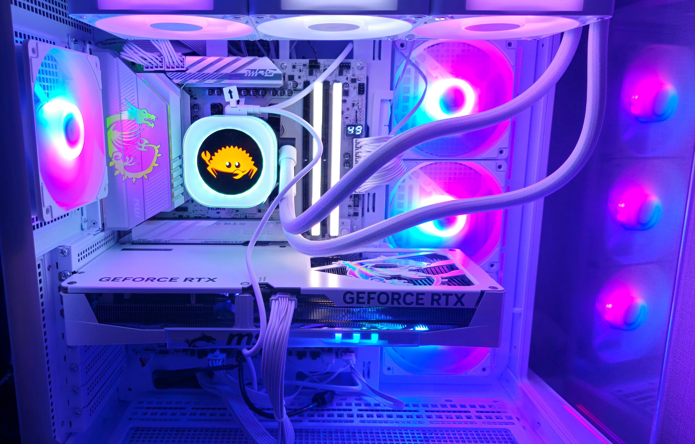

一念発起して新PCに引っ越した。

旧PCはちょこちょこパーツを換えていたのでいつぶりかと言われると厳密に答えるのは難しいが、少なくともCPUを買ったのは2021年10月らしい。いにしえだ。

新PCの構成と、rustcのコンパイル時間などを記録として残しておく。

## 構成



- CPU: AMD Ryzen 9 9950X3D
- GPU: NVIDIA RTX 5070 Ti
- M/B: MPG X870E EDGE TI WIFI
- CPU fan: iCUE LINK TITAN 360 RX RGB LCD White
- RAM: Corsair CMH32GX5M2E6000C36W
- SSD: WD_Black SN7100
- case: MSI MAG PANO 100R PZ WHITE
- PSU: Steel Legend SL-1000GW

rustcのcompileなど、CPU heavyなタスクをいくつかやるのでCPUは強めに、ほどほどにゲームもしたいのでほどほどのGPUにした。

今回は白色ビルドにした。目新しくていい。

## rustc builds

bootstrap configは以下の通り:

```toml
profile = "compiler"
build.jobs = 28
```

`./x clean` 後に `./x test tests/ui` でUI testを流したときの時間:

```shell
❯ hyperfine -r 1 './x t tests/ui'                                                                                                                         
Benchmark 1: ./x t tests/ui
  Time (abs ≡):        234.682 s               [User: 2560.617 s, System: 735.184 s]
```

まあまあ早そう。

負荷はこんな感じ:


雑に変更入れてUI test流すと:

```shell
❯ hyperfine -r 1 './x t tests/ui'                                                                                                                         
Benchmark 1: ./x t tests/ui
  Time (abs ≡):        135.148 s               [User: 1277.302 s, System: 634.298 s]
```

2分くらい。

check buildだと1分30秒くらい:

```shell
❯ hyperfine -r 1 './x c'
Benchmark 1: ./x c
  Time (abs ≡):        97.852 s               [User: 148.231 s, System: 11.708 s]
```

前PCのコンパイル時間を計測し忘れたのでなんとも言えないがまあ悪くない、か……？

最近rustcをコンパイルしてなかったのもあって恩恵を体感しづらい。残念。まあ絶対値としては満足ではある。

## おしまい

見た目のよさ重視でPCを組んだのは初めてなのでテンションが上がっている。

なんだかんだ4年くらいOSS活動を支えてくれた旧PCにも感謝。これからもゆるくやっていき。
